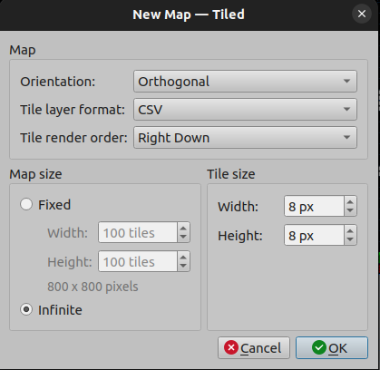
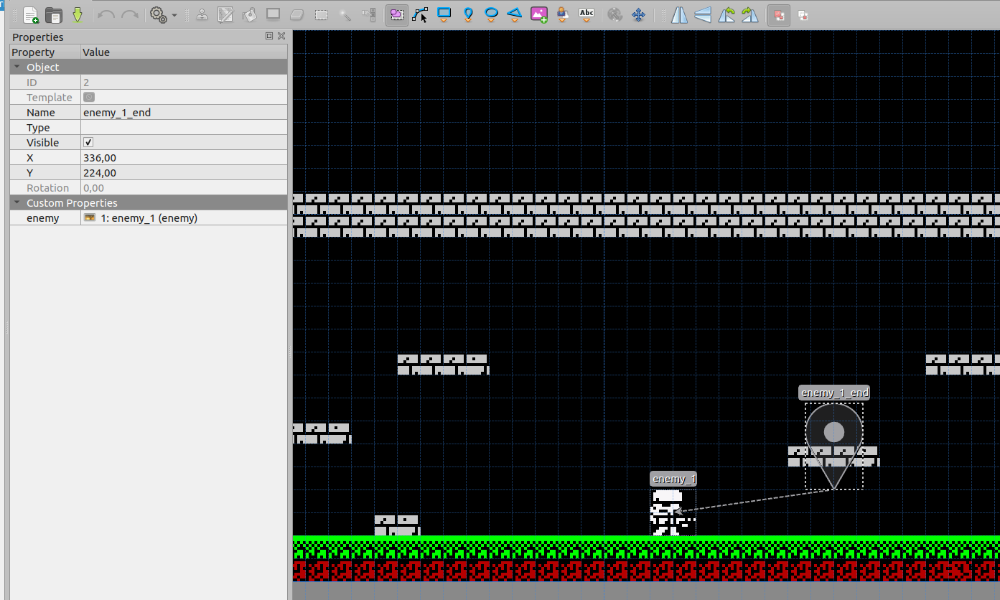

# ZX Game Maker

Tool for create ZX Spectrum games visually using [Tiled](https://www.mapeditor.org/) and the image editor that you prefers. We recommend [ZX Paintbrush](https://sourcesolutions.itch.io/zx-paintbrush), But you can use whatever you want just using ZX Spectrum requeriments (color, size)

## Tech

ZX Game Maker use [Boriel's ZX Basic](https://zxbasic.readthedocs.io/en/docs/) and [GuSprites sprites library](https://github.com/gusmanb/GuSprites) and python for scripting

## How to use

### Assets
#### Screens

You should create 3 screens png into assets/screens folder, loading.png, title.png, ending.png for loader, title screen and ending screen repectively

#### Tiles

You should create a 256x48 tiles png file (tiles.png) into assets folder. ZX Game Maker works with 8x8 pixels tiles, then you can create 256 tiles into this png.

The first tile always should be the background.

#### Sprites

You should create a 256 x 32 sprites png file (sprites.png) into assets folder. Each sprite is 16x16 pixels.

The 8 first sprits are reserved for game main character (0-2 for right movement, 3 for right jump, 4-6 for left movement, 7 for left jump).

The following 8 tiles wil be used for movement platforms, 2 tiles for each platform for animation.

The rest 16 tiles are reserved for enemies, 4 for each enemy, 2 frames for direction

### Tiled

Tiled is a powerfull tool to design game screens. Using Tiled you can create the map of the game and put elements like enemies, keys, items and doors.

Our game will have screen with 32x16 tiles.

#### Create map

You should create a map with the following properties:

* Orientation: Orthogonal.
* Tile layer format: CSV.
* Tile render order: Right Down.
* Map size: Infinite.
* Tile size: 8x8px.

Then go to Map > Properties and set the map to infinite and Output Chunk Width to 32 and Output Chunk Height to 16

#### Preferences

Or game will have 32x16 pixels for screen, then is recommended set in Preferences > Interface > Major grid to 32 tiles x 16 tiles to view each screen division

#### Create tilesets

You should create 2 tilesets, tiles, importing tiles.png (8x8px) and sprites importing sprites.png (16x16px).

Is important to set Object Aligment to sprites tileset properties to Top Left.

#### Create layers

I will use 2 layers a tile layer for tiles and object layer for enemies, keys, items, doors...

#### Adding elements

##### Enemy

You can add enemies into your map and set its movement (just horizontal for now). Set enemy in Type into object properties

##### Initial position

Select the object layer, click on insert tile button and put into the map adjusting in grid (press CTRL).

##### End position

For add en position:
* Click on insert point button.
* Put the point in the map (same x than enemy).
* Add custom object property and select the enemy related.

## Credits

* [Juan J. Martínez](https://github.com/reidrac) png2src
* [Michal Jurica](https://sourceforge.net/u/mikezt/) [ub880d](https://sourceforge.net/u/ub880d) bin2tap
* [Andy Balaam](https://github.com/andybalaam) bas2tap